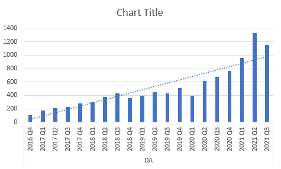
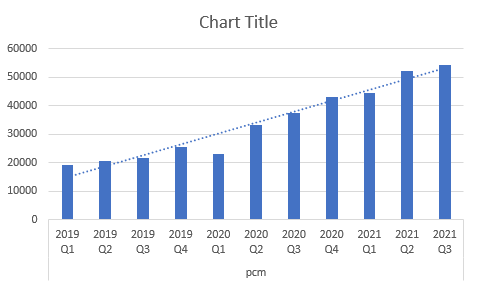

# super-investor

This program will gather the quartly valuation of each of the super investors portfolios.

## Usage

`npm start`
In this example the program will gather data and output the results into results.txt

## Output

The output format is a comma seperated list, for each importing into excel.

## Example extract from output

```
DA
2016 Q4,2017 Q1,2017 Q2,2017 Q3,2017 Q4,2018 Q1,2018 Q2,2018 Q3,2018 Q4,2019 Q1,2019 Q2,2019 Q3,2019 Q4,2020 Q1,2020 Q2,2020 Q3,2020 Q4,2021 Q1,2021 Q2,2021 Q3
107,177,213,231,277,296,379,427,360,398,447,426,508,396,619,673,764,956,1330,1150

pcm
2019 Q1,2019 Q2,2019 Q3,2019 Q4,2020 Q1,2020 Q2,2020 Q3,2020 Q4,2021 Q1,2021 Q2,2021 Q3
19100,20600,21700,25400,23100,33100,37400,43000,44500,52200,54500
```

## What does it do?

The purpose of the program is to rank the superinvestors. When the data is imported into excel, it is possible to create a graph to show the performance over time visually.

## Example graphs




